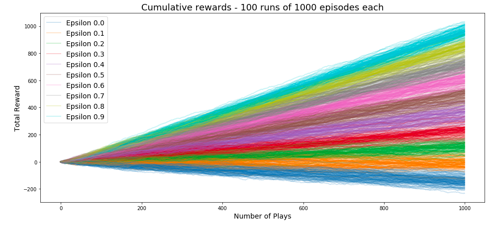

StarAI: Deep Reinforcement Learning

This is a [7 week course](https://sites.google.com/view/starai-course-beta/lessons-preview) by Sydney Machine Learning covering value based RL and policy based methods, and is hosted at Microsoft Reactor [Sydney](https://twitter.com/hashtag/reactorsydney), which is one of 5 spaces newly commisioned by MS for meetups, startups, lectures, workshops, all kinds of coomunity outreach stuff.

- [Paul Conyngham](https://twitter.com/paul_conyngham) of SML fame is running the course
- [@dglover](https://twitter.com/dglover) - cloud developer advocate at MS and IOT coder provided the space
- discussion is over at the [course forums](http://forums.starai.io/).
- Read [this RL intro](https://lilianweng.github.io/lil-log/2018/02/19/a-long-peek-into-reinforcement-learning.html)

So here goes my notes:
- [Introduction to Reinforcement Learning](#introduction-to-reinforcement-learning)
- [The Epsilon Greedy Algorithm](#the-epsilon-greedy-algorithm)
- [Markov Decision Processes, Dynamic Programming](#markov-decision-processes-dynamic-programming)
- [holding area, fix up with real notes when I get to it](#holding-area-fix-up-with-real-notes-when-i-get-to-it)

## Introduction to Reinforcement Learning

> In this lecture, we will take you on a journey into the near future by discussing the recent developments in the  field of Reinforcement Learning - by introducing you to what Reinforcement Learning is, how it differs from Deep Learning and the future impact of RL technology.

- Deep Minds paper - [Human level control through deep reinforcement level](https://deepmind.com/research/publications/human-level-control-through-deep-reinforcement-learning/) - rocked the world, nature put it on their cover, first step towards Artificial General Intelligence - the holy grail of AI.
- before this paper, ppl wrote specific algos to do stuff, which needed tons of domain expertise, like IBM's Deep Blue, and it could only do the one thing.
- RL can be thrown at different problems and it can adapt and sovle them without needing domain expertise.
- DQN achieved superhuman performance on many of the old atari games, like breakout
- Andrej Karpathy [has a RL demo here](https://cs.stanford.edu/people/karpathy/convnetjs/demo/rldemo.html)

## The Epsilon Greedy Algorithm

> In this lecture, we introduce you to your very first RL algorithm, Epsilon Greedy.  We start off by exploring a toy problem known as the "multi armed bandit problem" or in english- how to win at slot machines! We then dive down into how Epsilon-Greedy solves the bandit problem, go on a detour introducing OpenAi Gym (and why it is important!) and finally hand you over to your first exercise, solving the bandit problem in OpenAi Gym.

- RL definition: finding the optimal stategey to do something in the face of massive uncertainity
- **policy** is the fancy name used in RL for the strategy we are following to solve a problem
    - for example, to cross a road, we can have a strategy to stop at red lights, and since that sounds too simple, we call it a policy to make it sound more buzzwordy.
- multi armed bandit - how do choose the best slot machine to use, given we don't know the different payouts,so lots of uncertainity!
- RL has a lot of links to real life - many real life things can be looked at from a RL frame, like dating, finding a job, stock trading
- math refresher: the bell curve, or the normal distribution is centered around the mean. 
- with the multi armed bandit problem, we can play them many times and plot their rewards
- **epsilon** controls the ratio of exploration to exploitation
    - when `e=1` exploration is maximized, choose actions at random
    - when `e=1` exploitation is maximized, always choose what we think is the best action
    - we can subtract any mathematical function to scale epsilon: `e = 1 - f(x)`
    - simple strategy - start at 1, then with time scale it down to near zero. (we never want it to be zero)
- in a casino, the epsilon greedy algo works like so:
    - we sample each bandit, and with time decrease epsilon. as we gather data we build a reward distribution for each slot machine.
    - we find the distribution with the highest return, and we're done!
- [notebook implementing the multi-armed bandit problem using the epsilon greedy algo using OpenAI Gym]((https://github.com/khalido/starai/blob/master/notebooks/multiarmed_bandits.ipynb))

## Markov Decision Processes, Dynamic Programming

> In this lecture you will learn the fundamentals of Reinforcement Learning. We start off by discussing the Markov environment and its properties, gradually building our understanding of the intuition behind the Markov Decision Process and its elements, like state-value function, action-value function and policies. We then move on to discussing Bellman equations and the intuition behind them.  At the end we will explore one of the Bellman equation implementations, using the Dynamic Programming approach and finish with an exercise, where you will implement state-value and action-value functions algorithms and find  an optimal policy to solve the Gridworld problem.

- markov processs is a memoryless random process, a sequence of states with Markov Property
- State has all necessary info from the previous states, so no need to keep any history
- Markov Chain: s

---

## holding area, fix up with real notes when I get to it

Week 2 - Lesson 2b -  Monto Carlo Sampling, Temporal Difference Learning

In this short session, you will be introduced to the concepts of Monte-Carlo and Temporal Difference sampling. You will start off discussing the limitations of classic MDP and how they can be solved using MC and TD. In the second part of the lecture, you will learn the difference between MC and TD and when to apply each technique. This knowledge learned in this session will then be applied in next lecture's practical exercise.

Week 3 - Lesson 3a -  Tabular Q Gridworld

In this session, participants will focus on a specific method of Temporal Difference Learning called Tabular Q Learning. Participants will learn the theory behind Q Learning, implement the different components bit by bit and combine these components to solve the robot in a maze scenario. 

Week 3- Lesson 3b -  Tabular Q Cartpole

In this session, participants will explore the problem of an environment where observations are continuous variables. Participants will learn the discretisation technique and implement this with the previous components to solve the problem of keeping a cart pole upright without having any understanding of the observations. 

Week 4 - Lesson 4a -  NQL Theory

Neural Q-Learning builds on the theory developed in previous sessions, augmenting the tabular Q-Learning algorithm with the powerful function approximation capabilities of Neural Networks. NQL is the "base" algorithm unifying Neural Networks and Reinforcement Learning, and participants will be exposed to both the impressive generalization properties of this algorithm, as well as some of it's potential drawbacks and limitations. 

Week 4 - Lesson 4b -  DQN

Deep Q-Networks refer to the method proposed by Deepmind in 2014 to learn to play ATARI2600 games from the raw pixel observations. This hugely influential method kick-started the resurgence in interest in Deep Reinforcement Learning, however it's core contributions deal simply with the stabilization of the NQL algorithm. In these session these key innovations (Experience Replay, Target Networks, and Huber Loss) are stepped though, taking the participants from the relatively unstable NQL algorithm to a fully-implemented DQN.  

Week 5 - Lesson 5 - Policy Gradient Methods

In previous lectures, you were introduced to DQN - an algorithm that falls under the first major branch of Reinforcement Learning, "Value Based Methods". In this lecture, we introduce you to "Policy Gradient methods" the second major branch of Reinforcement Learning where we learn to manipulate the object we care about the most - the policy - directly.

Week 6 - Lesson 6 - Proximal Policy Optimization Algorithms

Proximal Policy Optimization is a state-of-the art method for continuous control and is currently OpenAI's "RL algorithm of choice". PPO is a heuristic version of TRPO (another continuous control algorithm that is highly justified analytically), that extends the concept of Vanilla Policy Gradients by considering the geometry of the parameter space. In this lecture we outline the motivations behind PPO and develop a basic implementation - taking the students to the very edge of current RL research.

Week 7 - Lesson 7 - DQN in Blizzard-Deepmind's PySC2 - Move to Beacon

 Starcraft 2 is a real time strategy game with highly complicated dynamics and rich multi-layered gameplay - which also makes it an ideal environment for AI research. PySC2 is Deepmind's open source library for interfacing with Blizzard's Starcraft 2 game. This session will introduce the PySC2 API, the observation space and the action spaces available & participants will build a simple DQN agent to play the Move to Beacon minigame provided with PySC2.